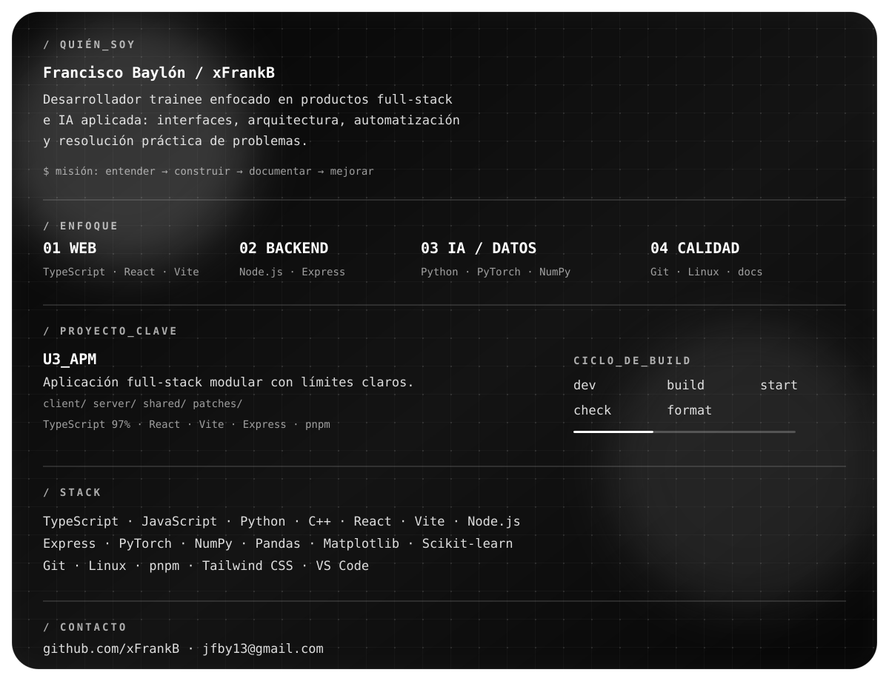
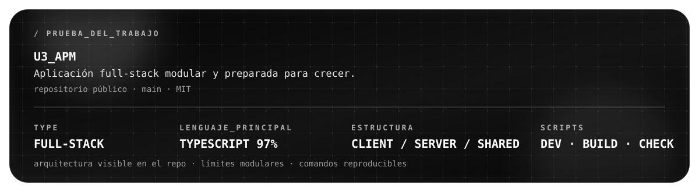
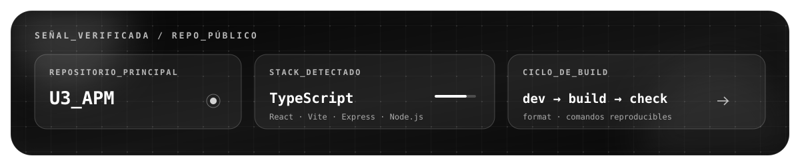
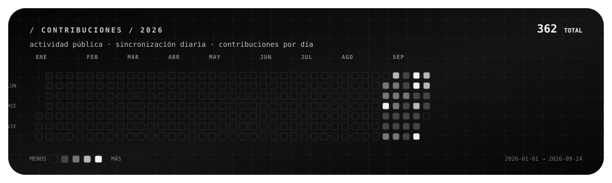
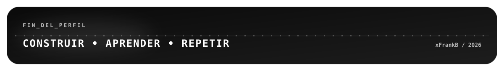

<picture>
  <source media="(prefers-color-scheme: dark)" srcset="./assets/hero-es.svg?v=7" />
  <source media="(prefers-color-scheme: light)" srcset="./assets/hero-es-light.svg?v=7" />
  
</picture>

  <a href="https://github.com/xFrankB" title="GitHub"><kbd>&lt;/&gt; GITHUB · @xFrankB</kbd></a> 
  <a href="mailto:jfby13@gmail.com" title="Contacto"><kbd>[CORREO] CONTACTO · jfby13@gmail.com</kbd></a> 
  <a href="https://github.com/xFrankB/U3_APM" title="U3_APM source code">U3_APM · VER CÓDIGO →</a>

<picture>
  <source media="(prefers-color-scheme: dark)" srcset="./assets/content-es.svg" />
  <source media="(prefers-color-scheme: light)" srcset="./assets/content-es-light.svg" />
  
</picture>

<picture>
  <source media="(prefers-color-scheme: dark)" srcset="./assets/evidence-es.svg" />
  <source media="(prefers-color-scheme: light)" srcset="./assets/evidence-es-light.svg" />
  
</picture>

<picture>
  <source media="(prefers-color-scheme: dark)" srcset="./assets/signal-es.svg" />
  <source media="(prefers-color-scheme: light)" srcset="./assets/signal-es-light.svg" />
  
</picture>

<picture>
  <source media="(prefers-color-scheme: dark)" srcset="./assets/contributions-es.svg" />
  <source media="(prefers-color-scheme: light)" srcset="./assets/contributions-es-light.svg" />
  
</picture>

<picture>
  <source media="(prefers-color-scheme: dark)" srcset="./assets/footer-es.svg" />
  <source media="(prefers-color-scheme: light)" srcset="./assets/footer-es-light.svg" />
  
</picture>

<code>DISPONIBLE PARA: oportunidades trainee / junior · construcciones colaborativas</code>

